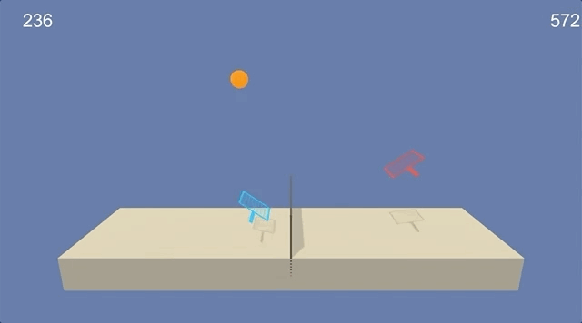

# Multi-Agent DDPG (MADDPG) for Collaboration and Competition

Solving a collaboration and competition task of two tennis rackets using two DDPG agents with shared experience buffer.



## Environment details
The objective of Unity's [Tennis environment](https://github.com/Unity-Technologies/ml-agents/blob/master/docs/Learning-Environment-Examples.md#tennis) is to train two agents to play tennis with each other in a cooperative way. The agents are rewarded for keeping the ball in play as long as possible. The task is considered solved when the average reward of the winning agent each episode hits 0.5 over 100 consecutive episodes.

**Action space:** For each of the two tennis rackets, two continuous actions are available, corresponding to movement toward or away from the net, and jumping.

**State space:** Each agent receives its own observation, consisting of 8 dimensions (position and velocity of the ball and the respective tennis racket). 

**Reward function:** The agents receives a reward after taking an action. A +0.1 reward is given if the agent hits the ball over the net and a -0.01 penalty if they miss the ball or hit it out of bounds. The algorithm provides to each agent the velocity and position of both agents and the ball, but only tells each agent their own reward, not the reward of the other agent. v

**MADDPG structure:** The adopted learning algorithm is a multi-agent variant of the DDPG algorithm (MADDPG), a model-free, off-policy, policy gradient-based algorithm that uses two separate deep neural networks (an actor and a critic) to both explore the stocastic environment and, separately, learn the best policy to achieve maximum reward. DDPG has been shown to be quite effective at continuous control tasks and here the multi-agent version is applied to this collaborative task.

MADDPG is a multi-agent Actor-Critic model: 
* Each Actor is a policy-based algorithm with high variance, taking relatively long to converge.
* Each Critic is a value-based algorithm with high bias instead

In this approach, each agent's Actor and Critic work together to reach better convergence and performance.

**Actor models**

Two individual neural networks with 3 fully connected layers:
* Fully connected layer 1: with input = 48 (twice the state space) and output = 256
* Fully connected layer 2: with input = 256 and output = 128
* Fully connected layer 3: with input = 128 and output = 2 (action space)

Tanh is used in the final layer that maps states to actions. Batch normalization is used for mini batch training.

**Critic models**

Two individual neural networks with 3 fully connected layers:
* Fully connected layer 1: with input = 48 (twice the state space) and output = 256
* Fully connected layer 2: with input = 260 (states and actions) and output = 128
* Fully connected layer 3: with input = 128 and output = 1 (maps states and actions to Q-values)

**Parameters used in the MADDPG algorithm:**
* Replay buffer size: BUFFER_SIZE = int(1e6)
* Minibatch size: BATCH_SIZE = 128
* Discount factor: GAMMA = 0.99
* Soft update of target parameters: TAU = 6e-2
* Learning rate of the actor: LR_ACTOR = 1e-3
* Learning rate of the critic: LR_CRITIC = 1e-3
* L2 weight decay: WEIGHT_DECAY = 0
* Time steps between network updates: UPDATE_EVERY = 1
* Number of times training: N_UPDATES = 1
* Noise level start: eps_start = 6 
* Noise level end: eps_end = 0   
* Number of episodes to decay over from start to end: eps_decay = 250  


## Installation instructions

Python 3.6 is required. The program requires PyTorch, the ML-Agents toolkit, and a few more Python packages required to complete the project.

```
git clone https://github.com/udacity/deep-reinforcement-learning.git  
cd deep-reinforcement-learning/python  
pip install .
```

Run the following to create drlnd kernel in ipython so that the right unity environment is loaded correctly:  


```python -m ipykernel install --user --name drlnd --display-name "drlnd"```

## Getting started

Place <mark>report.ipynb</mark> in the folder <mark>p3_collab-compet/</mark>.

The customized Unity Tennis environment used here can be downloaded from: 

Linux: [click here](https://s3-us-west-1.amazonaws.com/udacity-drlnd/P3/Tennis/Tennis_Linux.zip)  
Mac OSX: [click here](https://s3-us-west-1.amazonaws.com/udacity-drlnd/P3/Tennis/Tennis.app.zip)  
Windows (32-bit): [click here](https://s3-us-west-1.amazonaws.com/udacity-drlnd/P3/Tennis/Tennis_Windows_x86.zip)  
Windows (64-bit): [click here](https://s3-us-west-1.amazonaws.com/udacity-drlnd/P3/Tennis/Tennis_Windows_x86_64.zip)  

Choose the environment suitable for your machine. Unzipping will create another Reacher_xxxx folder. For example, if the Linux Tennis environment is downloaded, ```Tennis_Linux``` will be created. 

Run ```p3_collab-compet/report.ipynb```

Enter the right path for the Unity Reacher environment in report.ipynb. 

Run the remaining cells as ordered in ```report.ipynb``` to train the MADDPG algorithm. 
